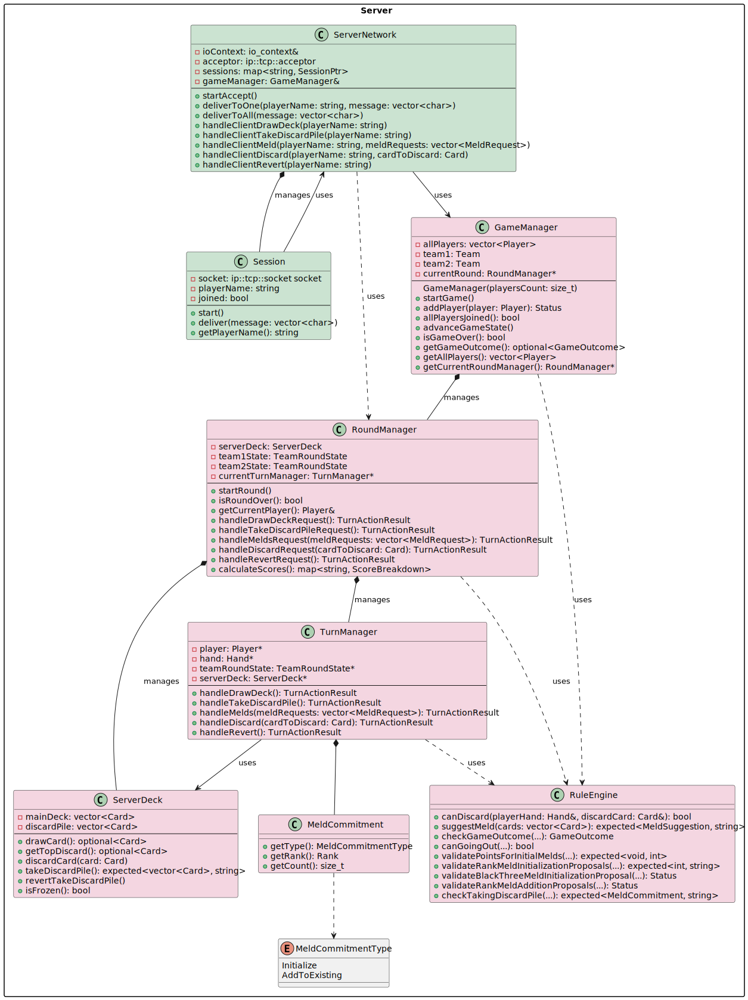

# Documentation

# 1. Introduction

Welcome to **Canasta**, a cross-platform desktop, networked implementation of the classic Canasta card game written in modern C++23.

---

# 2. High-Level Architecture

At the very top, **Canasta** is organized along two orthogonal dimensions:

## 2.1 Three-Tier Division

1. **Core Library**
        
    - Defines vast majority of playing concepts like card, hand, meld, player, team, scoring and data-transfer objects.
        
    - No I/O, no UI.
        
    
2. **Server**
    
    - Hosts the authoritative game engine and enforces all rules.

    - Advances turns and rounds, calculates scores, determines the result of the game

    - Manages player connections, message framing and per-player state dispatch.
        
    
3. **Client**
    
    - Terminal-based user interface.
        
    - Renders incoming game states, prompts for and validates user moves, and sends actions back to the server.
        
    - Keeps only a local view of the last received state plus any in-flight user input.
        
    

## 2.2 Five Functional Class Groups

  
Within those three tiers, classes fall into **five** color-coded groups that cut across the layers:

|**Color**|**Group Name**|**Responsibility**|
|---|---|---|
|**Light Purple** (#E2C0E3)|**DTOs**|Simple payload carriers with _only_ serialization. No business logic. Used exclusively to shuttle data between server ⇄ client.|
|**Light Blue** (#C0DBE3)|**Domain Entities**|Domain entities that encapsulate real behavior and validation, _plus_ serialization. They form the core representation of game state.|
|**Light Green** (#C0BE3D1)|**Networking**|Connection managers, session handlers, message framing and dispatch logic. They glue the DTOs to the wire, batching, ordering, and error handling.|
|**Light Orange** (#FCD299)|**UI**|Presentation widgets, text renderers, input guards and view models. Entirely client-side, they consume DTOs and models to drive the player UI.|
|**Light Pink** (#F4D6E1)|**Game Engine**|All orchestration & rule logic: deck & discard management, turn/round controllers, rule adjudication, and high-level game flow. These classes also coordinate and manage classes from all four other groups to drive the game.|

Together, these two perspectives ensure:

- **Separation of Concerns**:
    
    - Core library remains reusable by both server and client.
        
    - Server focuses on “truth” and enforcement.
        
    - Client focuses on “presentation” and input.
        
    
- **Modularity & Testability**

---

# 3. Module Breakdown

## 3.1 Canasta Core Library

The Canasta Core Library encapsulates the fundamental data types, domain logic, and transfer objects that underpin both the server and client. It is consumed by both the server executable and the client executable.

|**Color**|**Group**|**Classes**|
|---|---|---|
|**Light Purple** (#E2C0E3)|**DTOs**|ClientDeck, ScoreBreakdown, PlayerPublicInfo that are all placed into ClientGameState (server -&gt; client), MeldRequest (client -&gt; server).|
|**Light Blue** (#C0DBE3) | **Domain Entities**|Card, Hand, Player, BaseMeld, Meld&lt;R&gt;, BlackThreeMeld, RedThreeMeld, TeamRoundState.|
|**Light Pink** (#F4D6E1)|**Game Engine**| A single Team class, tracking player membership and cumulative score. Used by the server’s game engine to aggregate round results.|

### 3.1.1 DTOs (Light Purple)

These classes live in **Core** solely to package up state for network transport.  They expose only getters/setters (and Cereal hooks) and contain _no_ game rules:
    
- **ClientDeck**
    
    Snapshot of the main deck/discard-pile view (sizes, top discard card, frozen flag).
    
- **ScoreBreakdown**
    
    Detailed scoring components for one round (canasta bonuses, penalties, etc.).
    
- **PlayerPublicInfo**
    
    Name, hand-size, and “is this their turn?” flag.
    
- **ClientGameState**
    
    Aggregates all of the above plus player data, team round states, total scores, round over flag, game over flag, game outcome, last action description and status for server → client (broadcastGameState → handleGameStateUpdate) 

- **MeldRequest**

    Carries a vector of cards and an optional target rank for client → server (sendMeld → handleClientMeld)

---

### 3.1.2 Domain Entities (Light Blue)

These group lives in **Core** solely, contains types that encapsulate Canasta’s rules, maintain mutable state, and participate in serialization - but also carry real game logic

1. **Card & Enums**
    
    - Card encapsulates Rank, CardColor, CardType and precomputed points.
        
    - Supports full ordering and equality for game logic.
        
    
2. **Hand (Transactional Memento Pattern)**
    
    - Holds a sorted deque&lt;Card&gt; supports add/remove and penalty computation.
        
    - **Pattern**:
        
        - addCards(newCards, reversible=true) stages `cards` in a backup buffer.
            
        - revertAddCards() restores the previous snapshot on failure or rollback.

        This avoids pervasive exception-handling and keeps callers’ logic linear.

3. **Player**

    - has name and Hand

    - Offers resetHand() for new rounds.

    
4. **Meld Hierarchy (Prototype + Transactional Memento)**
    
    - **BaseMeld**
    
    - Declares **two‐step** operations for both initialization and addition:
        
        1. checkInitialization(const vector&lt;Card&gt;&) → Status
            
        2. initialize(const vector&lt;Card&gt;&)
            
        3. checkCardsAddition(const vector&lt;Card&gt;&) → Status
            
        4. addCards(const vector&lt;Card&gt;&, bool reversible = false)
            
        
    - Exposes isInitialized(), getPoints(), updatePoints(), getCards(), clone() and revertAddCards().
        
    
    - **Concrete Subclasses**
        
        - **Meld&lt;R&gt;** (one per rank), **RedThreeMeld**, **BlackThreeMeld**
            
        - Each overrides the four check/modify methods to **enforce its own meld‐rules** (e.g. wild-card limits, red-three rules).
            
        - **Pattern**: callers must always invoke “check…” before “initialize” or “addCards,” so invalid attempts are rejected cleanly without exceptions.
            
        
    - **Transactional Memento**
        
        - Both base and concrete melds snapshot their internal card lists exactly as Hand does; on explicit revertAddCards(), they roll back to the prior state.
            
        
    - **Prototype Pre-Instantiation**
        
        - instead of constructing meld objects on demand (which might throw), we create one instance of every concrete meld upfront. Each meld begins “uninitialized” and simply activates itself when valid cards arrive. This Prototype-inspired approach guarantees type safety and deferred validation without runtime failures.

    **Design Notes** 

    CanastaType enum has now 2 values Natural and Mixed. Wild type (that some non-official Canasta versions supports) could be added and Meld Hierarchy design gives us the opportunity not to change existing meld subclasses but to add a new one that supports Wild meld and Wild Canasta.
        

5. **TeamRoundState (Round-Scoped Aggregator)**

    - **Ownership & Lifecycle**
        
        - **Pre-creates**: 11 ranked melds + one red-three + one black-three per team in its constructor (createMelds()).
            
        - **Owns** them in a vector&lt;unique_ptr&lt;BaseMeld&gt; melds; so they live exactly as long as the round.
            
        
    - **Accessors & Operations**
        
        - const auto& getMelds(): enumerate all meld objects.
            
        - BaseMeld* getMeldForRank(Rank), getRedThreeMeld(), getBlackThreeMeld(): retrieve the correct prototype for checking/modification.
            
        - bool hasMadeInitialRankMeld(): true if any rank-meld is initialized.
            
        - int calculateMeldPoints(): sum of all melds’ points (excluding red-three).
            
        - ScoreBreakdown getScoreBreakdown(int goingOutBonus): full scoring summary including penalties and bonuses.
            
        - void reset(): clear every meld back to its uninitialized state.
            
        - TeamRoundState clone() const: deep copy (including each meld’s backup state).
            
        
    - **Patterns & Rationale**
    
        - Acts as a **round‐scoped facade**, keeping all meld logic in one place and tying it to a single lifecycle.
            
        - Leverages the **Prototype** pattern (pre-instantiated melds) with cloning.
            
        - Ensures that higher layers (GameManager, ServerNetwork) never need to know the details of how melds validate or roll back — those rules live entirely inside each BaseMeld subclass.

---

### 3.1.3 Team (Light Pink)

**Role & Responsibilities**

- Models a **team** of one or two players in a single game.
    
- Tracks the team’s **name**, its **member references**, and the **accumulated score** across rounds.
    
- Exposes only non-owning references to Player objects, so the same Player can participate in multiple teams or multiple games without ownership conflicts.
    

**Key API**

- Team(const std::string& name) — create a new team identity.
    
- addPlayer(Player& p) / hasPlayer(const Player& p) / getPlayers() — manage and inspect membership via std::reference_wrapper&lt;Player&gt;.
    
- getTotalScore() / addToTotalScore(int) — read and update the team’s running score.
    

**Design Notes**

- By storing **references** rather than Player instances, teams remain a **lightweight view**.
    
- This makes it trivial to support features such as:
    
    - A single Player account playing in multiple games.
        
    - Transferring a Player from one team to another without object duplication.

## 3.2 Canasta Server

The **Canasta Server** executable brings together classes from the **Game Engine** and the **Networking layer** to host a live multiplayer game:

- **Game Engine**
    
    Orchestrates the full round and turn lifecycle, enforces rules, manages the shared deck, and aggregates scores.
- **Networking layer**
    
    Listens for incoming TCP connections, deserializes client actions, and delivers per‐player state updates.

|**Color**|**Group**|**Classes**|
|---|---|---|
|**Light Pink** (#F4D6E1)|Game Engine|GameManager, RoundManager, TurnManager, ServerDeck, RuleEngine, MeldCommitment|
|**Light Green** (#CBE3D1)|Networking|ServerNetwork, Session|

### 3.2.1 Game Engine (Light Pink)

This group inside **server** contains classes that drive the complete match and round lifecycles, enforce Canasta’s rules, manage shared game state, and coordinate turn-by-turn actions.

1. **ServerDeck** is the authoritative source for card flows in a game. It owns:

    - **Main deck**
        
        A fully shuffled, 108-card Canasta deck, initialized and randomized once at round start.
        
    - **Discard pile**
        
        An ordered pile of discarded cards, automatically **freezing** itself whenever a Black Three or wild card is played.
        
    - **Reversible take-pile operations**
        
        When a player takes the discard pile with reversible = true, the entire pile contents and frozen/unfrozen state are atomically **backed up** and removed, discard pile become empty and not frozen. A single rollback call restores both pile contents and freeze flag, ensuring that any aborted or invalid take pile action leaves the game state unchanged.

2. **RuleEngine** is a stateless, purely static. It centralizes Canasta rule checks and validation logic. No instances are ever created — every method enforces a specific rule or computes a game decision:

    - **Meld validation**
        
        - Verifies whether a set of cards can initialize a new rank meld or a Black Three meld
            
        - Checks additions to existing rank melds against both the player’s hand and the team’s current round state
            
        - Ensures the team’s initial melds meet the minimum point threshold based on cumulative score
            
        
    - **Discard rules**
        
        - Confirms that a proposed discard is legal given the player’s hand and the discard‐pile’s frozen/unfrozen status
            
        
    - **Take‐pile commitments**
        
        - Determines if — and under what “commitment” constraints — a player may take the discard pile
            
        - On success, returns a MeldCommitment describing the exact number and type of cards that must be melded by turn’s end
            
        - On failure, returns a clear error message
            
        
    - **Go‐out & game‐outcome logic**
        
        - Checks whether a player may go out (based on completed canastas and remaining hand size)
            
        - Computes the overall game outcome (continue, team win, or draw) once a round concludes
            
        
    - **Utility functions**
        
        - Proposes a meld given arbitrary cards
            
        - Randomly rotates player/turn order
            
        - Encapsulates scoring constants (e.g. going-out bonus, meld thresholds) and helper routines (e.g. per-card point totals)
            
        
    By funneling every rule check through static methods, RuleEngine ensures that TurnManager, RoundManager, and GameManager never “reinvent” game logic — and that every validation remains consistent and free of hidden state.

3. **MeldCommitment** is immutable, value‐type object issued when a player takes the discard pile, bundling three pieces of information:

    - **type** (MeldCommitmentType) – a small enum field indicating whether the player must
        
        - **Initialize** a brand-new meld of the specified rank, or
            
        - **AddToExisting** cards to an already-open meld of that rank.
            
        
    - **rank** – the card rank (Four through Ace) that the player has committed to meld.
        
    - **count** – the exact number of cards of that rank the player must play by the end of their turn.
        

    Once constructed (by the RuleEngine), this commitment is used by TurnManager to guarantee that the player fulfills exactly the promised meld obligation.

4. **TurnManager** is a stateful service coordinating all phases of a single player’s turn — draw, take pile, meld, discard, and (optionally) revert, while enforcing Canasta’s complex turn rules. Internally it wires together references to the player’s hand, the shared deck, and the team’s round state, plus initial‐meld and score context.

    **Construction**

    Built once at the start of a player’s turn with:

    - **player**, **hand**, **teamRoundState**, **serverDeck** (all by reference)
        
    - **teamAlreadyHasInitialMeld** flag
        
    - **teamTotalScore**
        

    This injects exactly the dependencies needed to validate meld requirements, discard pile commitments, and “going out” rules.

    **Public API**

    - **handleDrawDeck() → TurnActionResult**
        
        Draws a card (non-reversible), enforces that it only runs in the draw/take phase, and adds to meld red threes automatically.
        
    - **handleTakeDiscardPile() → TurnActionResult**
        
        Tentatively takes the entire discard pile (reversible). On success, captures a MeldCommitment.
        
    - **handleMelds(requests) → TurnActionResult**
        
        Processes a batch of meld requests during the meld/discard phase: splits into initialization vs. addition proposals, validates via the server’s RuleEngine, applies to TeamRoundState (reversible), performs end-of-turn and “went out” checks.
        
    - **handleDiscard(card) → TurnActionResult**
        
        Finalizes the turn by discarding exactly one card (non-reversible), performs end-of-turn and “went out” checks.
        
    - **handleRevert() → TurnActionResult**
        
        Undoes all reversible actions (take-pile, melding) by restoring backups and proposal state.
        

    **Key Internal Mechanics**

    - **Phase Guards & Flags**
        
        Tracks booleans (drewFromDeck, tookDiscardPile, meldsHandled) to ensure each handler runs only in its allowed phase.
        
    - **Transactional Proposals / Memento**
        
        - Collects and validates rankInitializationProposals and rankAdditionProposals before applying any meld changes.
            
        - On handleTakeDiscardPile, atomically backs up and clears the discard pile and its frozen flag.
            
        - On handleMelds, captures proposed card groupings, validates them via the RuleEngine, then applies all-or-nothing with the ability to roll back.
            
        
    - **Commitment Enforcement**
        
        After a successful take-pile, enforces the exact meld commitment (rank & count) before allowing the final discard.
        

    Together, these patterns guarantee an all-or-nothing turn: invalid or aborted actions leave both hand and shared game state unchanged, while valid sequences transition cleanly to the next player.

5. **RoundManager** coordinates an entire Canasta round from initial deal through player turns to final scoring. It owns per‐round state and delegates each turn to a TurnManager, ensuring seamless progression and cleanup.

    
    **Construction & Round Lifecycle**

    - **Constructed** with all players in turn order and immutable references to each team.
        
    - **startRound()**
        
        - Shuffles and deals INITIAL_HAND_SIZE cards per player.
            
        - Initializes the shared deck & discard pile.
            
        - Picks the first player and transitions phase to **InProgress**.
            

    **Turn Delegation**

    - **getCurrentPlayer()** returns the active player reference.
        
    - Each client action (draw, take pile, meld, discard, revert) is handled by a matching handleXRequest(), which:
        
        1. Forwards the call into the current turn’s TurnManager.
            
        2. Invokes processTurnResult(), which applies success/failure logic, advances to the next player on turn‐over, or ends the round on a “went out.”
            
    **Round Completion & Scoring**

    - **isRoundOver()** returns true once a player goes out or the main deck empties and no further turns are possible.
        
    - **calculateScores()** computes each team’s ScoreBreakdown from their TeamRoundState.
    

    **Client‐Facing State Queries**

    - **getClientDeck()** returns a serializable snapshot of the main deck size, top discard, and frozen flag.
        
    - **getAllPlayersPublicInfo(me)** returns the public info list for all the players so that “me” player appears first.
        
    - **getTeamStateForTeam(team)** clones a team’s TeamRoundState for serialization.
        

    _Patterns & Guarantees_

    - **Single‐Responsibility:** RoundManager solely drives round‐level concerns; turn‐level logic lives in TurnManager.
        
    - **Encapsulation:** Internal helpers (dealInitialHands, advanceToNextPlayer) keep high‐level methods clear.
        
    - **Fail‐Safe Progression:** All results funnel through processTurnResult, guaranteeing that invalid actions cannot corrupt round flow.

6. **GameManager** orchestrates the end-to-end lifecycle of a Canasta match: collecting players, forming teams, advancing through multiple rounds, and determining the overall winner.

    - **Player Registration & Teams**
        
        - Constructed with a fixed playersCount (2 or 4).
            
        - **addPlayer(name)** + **allPlayersJoined()** manage the lobby phase.
            
        - Once full, invokes **setupTeams()** to assign players into two teams.
            
        
    - **Game Start & Phase Transitions**
        
        - **startGame()** begins the first round (throws if already started).
            
        - Internally tracks a GamePhase (NotStarted → RoundInProgress → BetweenRounds → Finished).
            
        - **advanceGameState()** is called after each round:
            
            1. If the current round reports over, calls **handleRoundCompletion()** to update cumulative scores.
                
            2. If no team has reached the win threshold, launches **startNextRound()**.
                
            3. Otherwise, sets finalOutcome and transitions to **Finished**.
                
            
    - **Round Delegation**
        
        - **getCurrentRoundManager()** hands back the active RoundManager, allowing the networking layer to route client actions onward.
            
        
    - **Game Conclusion & Queries**
        
        - **isGameOver()**, **getGameOutcome()**, and **getWinningTeam()** expose final results once the win condition is met.
            
        - **getAllPlayers()** and **getPlayerByName()** provide read-only access to player objects.
            

    _Design Notes_

    - **Single-Responsibility:** Confines high-level match orchestration here; per-round details live in RoundManager.
        
    - **Encapsulation:** Teams and players are owned directly, while each round is wrapped in a fresh RoundManager.
        
    - **Robustness:** State transitions guarded by gamePhase checks to prevent illegal retries or double-starts.

---

### 3.2.2 Networking (Light Green)

Handles all TCP client connections and message framing in a thread safe way, deserializes incoming actions, and marshals them onto the single game engine strand; also serializes and delivers per player game state updates back to each client.

1. **Session**

    **Role & Responsibilities**

    - Manages exactly one client’s lifetime: from TCP accept, through login handshake, to subsequent game-action dispatching.
        
    - Implements a simple message framing protocol: reads a 4-byte size header followed by a binary payload.
        
    - Deserializes incoming payloads into typed messages, enforcing that clients send a Login first, then only game commands.
        
    - Queues outgoing data frames and writes them in FIFO order on the socket’s strand, preserving message ordering and thread safety.
        
    - Detects and handles connection errors or malformed data by cleanly tearing down the session and notifying the server.
        

    

    **Key Operations**

    1. **start()**
        
        - Kicks off the asynchronous read loop by initiating a header read.
            
        
    2. **doReadHeader & handleReadHeader**
        
        - Allocates exactly 4 bytes, reads network-order size, converts to host order, validates it, then proceeds to body.
            
        
    3. **doReadBody & handleReadBody**
        
        - Reads the declared number of bytes into a buffer, then invokes processMessage().
            
        
    4. **processMessage()**
        
        - Unpacks a ClientMessageType and either routes to processLoginMessage() (if not yet joined) or processGameMessage().
            
        - Each of those handlers deserializes any parameters and posts them onto the shared gameStrand.
            
        
    5. **deliver(message)**
        
        - Enqueues a pre-serialized byte vector onto a write queue and, if idle, starts an async write.
            
        - Ensures all writes occur in-order on the socket’s implicit strand.
            

2. **ServerNetwork** owns the TCP listener and the lifecycle of all active Session objects.  It bridges raw network I/O and our single‐threaded game engine by:

    - **Accepting connections**
        
        An asio::ip::tcp::acceptor runs on the shared io_context, spawning a new Session for each TCP client.
        
    - **Managing sessions**
        
        Keeps a thread-safe map&lt;string, SessionPtr&gt; of connected players, guarded by a mutex.  Clients may connect or disconnect on any thread, but all session bookkeeping (join/leave) safely synchronizes via the mutex.
        
    - **Dispatching game actions**
        
        Each handler (handleClientDrawDeck, handleClientMeld, etc.) is invoked by its Session on receipt of a complete message.  Instead of running immediately, the action is posted to a single gameStrand (an ASIO strand), ensuring **all** game-engine calls execute sequentially.  This eliminates any risk of concurrent rule-checks or state mutations across players.
        
    - **Broadcasting and delivery**
        
        Provides deliverToOne and deliverToAll to enqueue serialized messages into session write queues.  These respect socket strands so that writes never interleave or race. The core broadcastGameState method, also run on the gameStrand, sends per-player ClientGameState to all the players. This ensures every client stays perfectly in sync and that round transitions are broadcast atomically.
        
    - **Friendship with Session**
        
        Declares friend class Session; so that sessions can invoke private join/leave methods without exposing them publicly.
        

    **Concurrency & Safety**

    - **I/O threads** handle accepts and per-session reads/writes in parallel.
        
    - **Game strand** serializes all game logic calls, preventing data races in GameManager and RoundManager.
        

    **Patterns & Best Practices**

    - **Reactor pattern** via ASIO’s async accept/read/write for non-blocking I/O.
        
    - **Command dispatch** in dispatchAction (a template that checks turn validity and then invokes a lambda).
        
    - **Strand-based single-threaded execution** for core game logic, avoiding explicit locks within game classes.
        
    - **RAII** for resource management — Session lifetimes tied to shared pointers, acceptor socket closed on shutdown.

## 3.3 Canasta Client

The **Canasta Client** executable unifies three layers to deliver a responsive, terminal-based player experience:

    
- **Networking**
    
    ClientNetwork frames and serializes player actions to the server, and receives/deserializes game updates.
    
- **UI**
    
    Render the board and scores, display messages, and prompt user choices via interactive wizards.

- **Game Engine**
    
    Coordinates local turn flow and UI state based on server callbacks via ClientController.

|**Color**|**Group**|**Classes**|
|---|---|---|
|**Light Green** (#CBE3D1)|Networking|ClientNetwork|
|**Light Orange** (#FCD299)|UI|GameView, CanastaConsole, InputGuard, CardView, MeldView, BoardState, ScoreState|
|**Light Pink** (#F4D6E1)|Game Engine|ClientController|

### 3.3.1 Networking (Light Green)

This group inside client handles the low-level TCP connection, frames each message with a size header, serializes outgoing player actions, and deserializes incoming server messages. It exposes a simple callback API so the rest of the client can react to game-state updates, action errors, login results, and disconnects—all on a single ASIO I/O context.

**ClientNetwork** is responsible for:

- **Connection lifecycle**
    
    Asynchronously resolves the server address, establishes the TCP connection, and performs an initial login handshake. Cleanly tears down on disconnect or destruction.
    
- **Message framing & queueing**
    
    Prepends a fixed-size length header to every outgoing payload, enqueues it, and drives asynchronous writes. Reads incoming headers to determine body length before reading full messages.
    
- **Serialization & transport**
    
    Uses Cereal to serialize action requests (draw, take pile, meld, discard, revert) into byte buffers and to deserialize ClientGameState / error payloads from the server.
    
- **Callback dispatch**
    
    Implements an **Observer**-style API: clients register handlers for
    
    - game-state updates
        
    - action errors
        
    - login success/failure
        
    - disconnect events
        
        Internally it safely invokes these callbacks on message arrival.
        
- **Asynchronous Reactor pattern**
    
    Leverages ASIO’s non-blocking reads and writes with resolver, socket, and strand, ensuring that all network events are funneled through a single I/O loop.

No other client component interacts directly with sockets—everything flows through ClientNetwork’s clean, event-driven interface.

---

### 3.3.2 UI (Light Orange)

This group lives fully on the client, providing terminal-based rendering of the board and scores, low-level console I/O, and interactive wizards for all player choices.

1. **CanastaConsole** and **InputGuard** together provide a robust, cross-platform terminal I/O foundation for the client’s UI.

    **CanastaConsole** initializes the console for UTF-8 and ANSI escape sequences (on both Windows and POSIX systems) and offers a simple print(...) method that wraps strings in color codes and optional line breaks, plus a clear() to reset the screen.

    **InputGuard** uses RAII to disable line-buffering and echo on construction (via Windows console APIs or POSIX termios) and automatically restores the original mode on destruction, ensuring secure, unbuffered user input during interactive prompts.

    By encapsulating platform-specific setup and teardown, these two classes let higher-level UI components render colored text and capture keystrokes reliably across Windows, Linux (and macOS).

2. **CardView** and **MeldView** are lightweight view-model classes in the client’s UI layer, carrying just the data needed to render cards and melds without any business logic.
    
    By separating these simple DTOs from the rest of the application logic, GameView can iterate over collections of CardView and MeldView to render the board and meld wizards cleanly and efficiently.

3. **BoardState** aggregates everything the UI needs to render a snapshot of play: the player’s hand, both teams’ melds (as MeldView), the current deck/discard (ClientDeck), and public player info in each seating position, plus raw scores and meld-point totals. The ClientController **populates** this object from each incoming ClientGameState and hands it off to GameView, which simply calls its getters to know what to draw.

    **ScoreState** bundles round-end scoring data for display: each team’s detailed breakdown (ScoreBreakdown), total scores, player count, and whether the game is over (with outcome). ClientController likewise fills this from the latest game update and gives it to GameView for rendering the score screen.

4. **GameView** is the heart of the client’s UI layer — a self-contained implementation that uses FTXUI (via &lt;ftxui/dom/elements.hpp&gt;, &lt;ftxui/component/...&gt;) to render rich, cross-platform terminal interfaces on Windows, Linux (and macOS).  All console, layout, color, and input logic lives in game_view.hpp/.cpp; nothing outside — **not even** the **ClientController** (that manages **GameView**) — needs to know it uses FTXUI.  It's possible to swap out the entire UI library without touching any code outside or migrate to a GUI toolkit modifying only controller code.

**Simple Prompts**

- promptString(...)
    
    Displays a one‐line question with a text box, reads a full line.
    
- promptChoiceWithBoard(...)
    
    Renders the entire boardState alongside a vertical list of options.  Highlights the current selection, handles up/down keys, and returns the chosen index.  An optional status message can be shown above the board.
    
**Wizards**

- runMeldWizard(...)
    
    Presents a multi-page wizard that shows the current boardState, allowing card-by-card selection of melds. Returns a vector of MeldRequest.
    
- Card runDiscardWizard(const BoardState& boardState)
    
    Similar to the meld wizard but for choosing a single discard card. Returns the selected Card.
    

**Static Displays**

- showStaticBoardWithMessages(...)
    
- void showStaticScore(...)
    
    Both methods **clear the screen**, disable line-buffered input (via InputGuard) to “freeze” the view, and render either the full game board (with messages) or the score summary.  They leave the console in a non-interactive state — **it's required to call** restoreInput() before invoking any prompt or wizard again.
    
- void restoreInput()
    
    Restores the original console modes (line buffering, echo) so prompts and wizards will work correctly after a static display.
    

**Internal Helpers**

All FTXUI elements and layout logic are hidden behind private methods:

- CardView getCardView(const Card&) & Element makeCardElement(...)
    
- Element makeBoard(...)
    
- Element makeHandGrid(...)
    
- Element makeDeckInfo(...)
    
- Element makeScoreInfo(...)
    
- Element makeMeldGrid(...)
    
- Element makePlayerInfo(...)
    

Each helper transforms DTOs into FTXUI Elements, applying padding, colors, and grid layouts.

---

### 3.3.2 Game Engine (Light Pink)

This group on the **client** side contains a single orchestrator — **ClientController** —which glues together the networking, UI, and local action state tracking to drive each turn from the player’s perspective. It receives server callbacks, updates its currentBoardState, invokes GameView wizards/prompts, and issues actions via ClientNetwork.

**Overview**

- Receives server-driven events via **ClientNetwork** callbacks.
    
- Maintains an internal turn-phase state machine, tracked by ActionAttemptStatus flags.
    
- Drives user interaction by calling **GameView** methods in the correct sequence.
    
- Sends player decisions back to the server through **ClientNetwork**.

**Detailed Behavior**

1. **Connection & Login**
    
    - On connect(host, port), prompts the player’s name via GameView.promptString().
        
    
2. **Turn-Phase State Machine**
    
    - **Draw/Take Phase**:
        
        - Calls GameView.promptChoiceWithBoard("Draw or Take?", ["Draw Deck","Take Pile"], boardState, message)
            
        - Sets drawDeckAttemptStatus = Attempting and issues network->sendDrawDeck() or takeDiscardPileAttemptStatus = Attempting and issues network->sendTakeDiscardPile().
            
        
    - **Meld Phase**:
        
        - Calls GameView.runMeldWizard(boardState) to collect one or more MeldRequest.
            
        - Marks meldAttemptStatus = Attempting and calls network->sendMeld(requests).

    - **Possible Revent Phase**: 
    
        - Reset all internal reversible statuses.

        - Calls network->sendRevert().
            
    
    - **Discard Phase**:
        
        - Calls GameView.runDiscardWizard(boardState) to pick a card.
            
        - Sets discardAttemptStatus = Attempting and calls network->sendDiscard(card).
            
        
    - **Turn End**:
        
        - If round over and it isn't the last round, uses GameView.showStaticScore(scoreState) for a fixed SCORE_TIME otherwise 
        calls GameView.showStaticScore(scoreState) without any timeout and game outcome stays on screen.
            

3. **Passive Updates**
    
    Whenever the board state arrives outside of this client’s turn (e.g. another player acted), the controller invokes 
    GameView.showStaticBoardWithMessages to show the new state plus the server-sent description of the last successful action.
    
4. **Error Recovery & Revert**
    
    - On any handleActionError, resets the relevant ActionAttemptStatus to NotAttempted, displays the error, and re-invokes the last prompt.
        
    
5. **Separation of Concerns**
    
    - **ClientController** never performs I/O or serialization directly; it relies entirely on **GameView** and **ClientNetwork**.
        
    - Implements an internal finite-state machine for turn phases, using callback registration (Observer pattern) and dependency injection.
        
    - Because it only knows the public interfaces of **GameView** and **ClientNetwork**, swapping out the UI library or network transport requires no changes to **ClientController** itself.

---