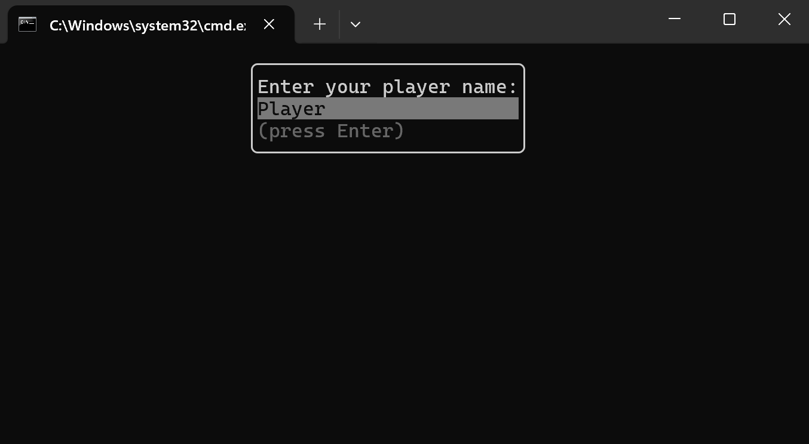
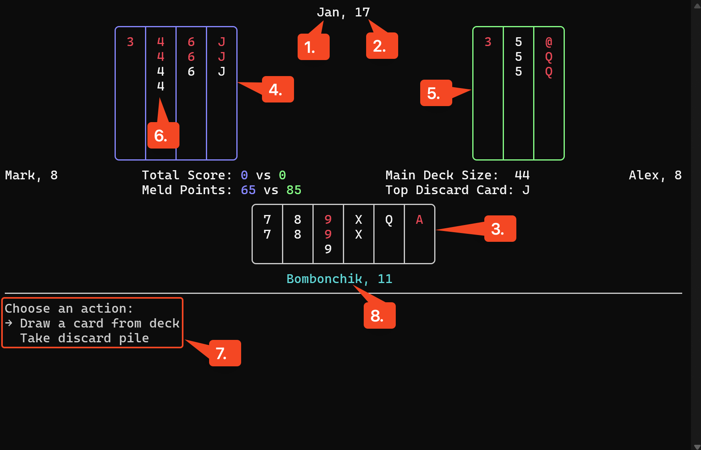
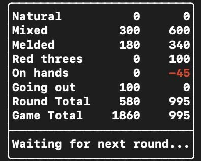
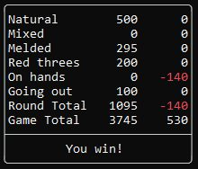

# Playing the Game

> **Note:** This implementation follows the official Canasta rules, which are _not_ reproduced here. This document explains **how to use the interface** and **play** via the terminal UI.

## 1. Starting the Game

1. Launch the server or client as described in the [**Installation guide**](INSTALL.md).
2. When prompted, **enter your player name** and press **Enter**.  

3. Wait for all players to connect. Once everyone is ready, the game will begin automatically.

## 2. Understanding the Interface

Once the game screen loads, you’ll see something like this:  

| # | Element                         | Description                                                                                             |
|:-:|---------------------------------|---------------------------------------------------------------------------------------------------------|
| 1 | **Player Name**                 | Your name (or another player’s), displayed at the top of each column.                                   |
| 2 | **Hand Count**                  | The number of cards currently in that player’s hand.                                                    |
| 3 | **Your Hand**                   | The cards in your hand.                                           |
| 4 | **Your Team’s Melds**           | All melds your team has laid down so far.                                                   |
| 5 | **Opponent Team’s Melds**       | All melds laid down by the opposing team.                                                               |
| 6 | **Highlighted Meld**            | Example of a meld of four.                           |
| 7 | **Action Menu**                 | During your turn, use **↑/↓** to navigate, **Enter** or **Space** to select, and **Esc**.     |
| 8 | **Active Player Indicator**     | A player’s name in **light blue** means it’s currently their turn.                                      |

> **Note:** When any meld reaches Canasta status, a **C** will appear at the bottom of that meld.

- **Main Deck Size:** How many cards remain in the draw pile.  
- **Top Discard Card:** The rank and suit of the card on top of the discard pile.

## 3. Card Notation

- **Red text** = red suit (♥ ♦)  
- **White text** = black suit (♣ ♠)  

| Symbol | Rank   |
|:------:|--------|
| `@`    | Joker  |
| `2`–`9`| Two–Nine |
| `X`    | Ten    |
| `J`    | Jack   |
| `Q`    | Queen  |
| `K`    | King   |
| `A`    | Ace    |

## 4. Taking Actions

On your turn, the **Action Menu** (➎) will guide you through:

1. **Draw from the main deck**  
2. **Take the discard pile**  
3. **Create a new meld** or **add to an existing meld**  
4. **Discard one card**
5. **Revert previous action(s)**

Use the prompt to choose the next action. If you attempt an illegal move, the game will display an error message explaining why.

## 5. End of Round & Scoring

At the end of each round, a summary of points earned by each team appears for a short time;
> **Note:** if it wasn’t the final round, play automatically begins the next round once the summary disappears

- **Natural**, **Mixed**, **Melded**, **Red Threes**, **On Hands**, **Going Out**  
- **Round Total** = sum of above  
- **Game Total** = cumulative score across all rounds  

If it was the **final round**, you’ll also see the game result:

## Good Luck & Have Fun!